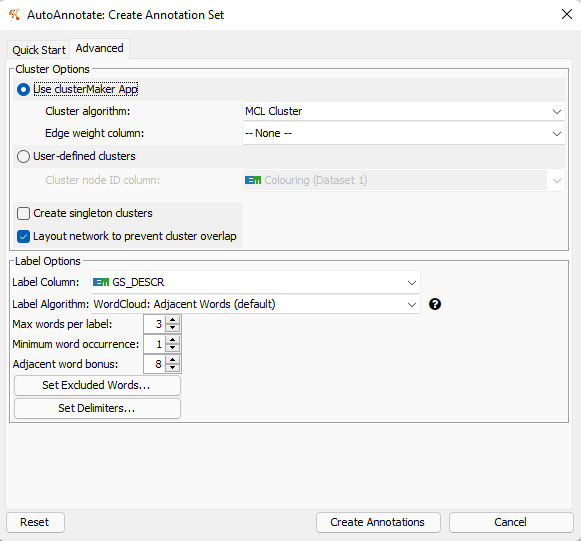

```{r setup, include=FALSE}
knitr::opts_chunk$set(echo = TRUE)
suppressWarnings(
{
if (!requireNamespace("BiocManager", quietly = TRUE))
    install.packages("BiocManager")
if (!requireNamespace("GEOmetadb", quietly = TRUE))
    BiocManager::install("GEOmetadb")
if (!requireNamespace("limma", quietly = TRUE))
    BiocManager::install("limma")
if (!requireNamespace("AnnotationDbi", quietly = TRUE))
    BiocManager::install("AnnotationDbi")
if (!requireNamespace("org.Hs.eg.db", quietly = TRUE))
    BiocManager::install("org.Hs.eg.db")
if (!requireNamespace("edgeR", quietly = TRUE))
    BiocManager::install("edgeR")
if (!requireNamespace("readxl", quietly = TRUE))
    BiocManager::install("readxl")
if (!requireNamespace("RColorBrewer", quietly = TRUE))
    install.packages("RColorBrewer")
if (!requireNamespace("tidyverse", quietly = TRUE))
    install.packages("tidyverse")
if (!requireNamespace("ggplot2", quietly = TRUE))
    install.packages("ggplot2")
if (!requireNamespace("dplyr", quietly = TRUE))
    install.packages("dplyr")
if (!requireNamespace("gprofiler2", quietly = TRUE))
    install.packages("gprofiler2")
if (!requireNamespace("ComplexHeatmap", quietly = TRUE))
    install.packages("ComplexHeatmap")
if (!requireNamespace("RCy3", quietly = TRUE))
    BiocManager::install("RCy3")
if (!requireNamespace("fgsea", quietly = TRUE))
    BiocManager::install("fgsea")
if (! requireNamespace("GSA", quietly = TRUE))
    BiocManager::install("GSA")
if (! requireNamespace("RCurl", quietly = TRUE))
    BiocManager::install("RCurl")}
)

suppressPackageStartupMessages({
  library(tidyverse)
  library(edgeR)
  library(GEOmetadb)
  library(RColorBrewer)
  library(ggplot2)
  library(readxl)
  library(dplyr)
  library(AnnotationDbi)
  library(limma)
  library(Biobase)
  library(BiocManager)
  library(biomaRt)
  library(magrittr)
  library(GEOquery)
  library(RSQLite)
  library(limma)
  library(org.Hs.eg.db)
  library(gprofiler2)
  library(ggrepel)
  library(fgsea)
  library(RCy3)
  library(GSA)
  library(RCurl)
})
```

# Overview

The purpose of this assignment is to take the normalized expression data that was created in Assignment #1 and then rank genes according to differential expression. With that ranked list perform thresholded over-representation analysis(ORA) to highlight dominant genes/themes in the top set of genes, in Assignmnet 2. Using this information, to try and determine if there is indeed a link between the genes and the disease that they cause. Then see if using non-threshold analysis will give us the same if not similar results to lead us to state that there are genes responsible for the effects of the affected groups. 

The next two sections will deal with providing background information from the paper and previous assignments. 

The link to the journal can be found at the end of the document, or by clicking the related subheading in the table of contents above. 

# Background information here, paraphased from the paper. 
This was a really interesting paper, but I will save that discussion for the later part of this assignment. A prior transcriptome meta-analysis found significantly decreased levels of corticotropin-releasing hormone (CRH) mRNA in corticolimbic brain areas in MDD patients, indicating that cortical CRH-expressing (CRH+) cells are impaired in MDD. Although rodent studies reveal that cortical CRH is predominantly expressed in GABAergic interneurons, little is known about the characteristics of CRH+ cells in the human cerebral cortex and their relationship to MDD. Human volunteers without brain illnesses had their subgenual anterior cingulate cortex (sgACC) identified for CRH and markers of excitatory (SLC17A7), inhibitory (GAD1), and other interneuron subpopulations using fluorescent in situ hybridization (FISH) (PVALB, SST, VIP). Changes in CRH+ cell density and cellular CRH expression (n = 6/group) were investigated in MDD patients. RNA-sequencing was done on sgACC CRH+ interneurons from comparison and MDD participants (n = 6/group) to see if there were any variations between the two groups. In mice with TrkB function suppressed, the effect of decreased BDNF on CRH expression was investigated. GABAergic cells made up 80 percent of CRH+ cells, whereas glutamatergic cells made up 17.5 percent. VIP (52%) and SST (7%), as well as PVALB, were co-expressed by CRH+ GABAergic interneurons (7 percent ). MDD patients had lower CRH mRNA levels in GABAergic interneurons than control participants, despite no differences in cell density. The transcriptome profile of CRH+ interneurons suggests decreased excitability and less GABA release and reuptake. Further research revealed that these molecular alterations are not caused by altered glucocorticoid feedback, but rather occur downstream of a common neurotrophic function modulator.

Essentially, there was a strong relationship between the gene expression or lack thereof for individuals who suffered from MDD. 

Here is a direct link to the query for this dataset. 
([GSE193417](https://www.ncbi.nlm.nih.gov/geo/query/acc.cgi?acc=GSE193417)).

Here is a direct link to the paper that is associated with the dataset above. 
([PMID: 35280164](https://www.ncbi.nlm.nih.gov/pubmed/35280164))
([PMCID: PMC8913899](https://www.ncbi.nlm.nih.gov/pmc/articles/PMC8913899/))

# Ideas, Interpretation, basic statistics and analysis from A1 and A2
In Assignment 1, we created log density graphs, MDS plots, MA plots after we chose a expression dataset from GEO database so that we may use them for analysis and processing as one would do in the field of bioinformatics. After selecting this expression set, we are to retrieve it, map it, normalize it, and finally interpret it, by use of graphs and plots as mentioned earlier. The conclusion that I came to in Assignment 1 was that there was in fact a strong relationship between the genes, their expressions and the results the authors of the paper had. \newline

The dataset ([GSE193417](https://www.ncbi.nlm.nih.gov/geo/query/acc.cgi?acc=GSE193417)), started with 19961 genes for each of the 12 Samples; CRH-Hu1001 sgACC_MDD,	CRH-Hu103 sgACC_control, CRH-Hu1047	sgACC_control, CRH-Hu1086	sgACC_control, CRH-Hu513 sgACC_MDD, CRH-Hu600	sgACC_MDD, CRH-Hu615 sgACC_control, CRH-Hu789	sgACC_control, CRH-Hu809	sgACC_MDD, CRH-Hu852 sgACC_control. Where sgACC_control groups are individuals have unimpaired CRH+ cells whereas MDD individuals have impaired CRH+ cells. After cleaning and normalizing the data, by removing genecounts that were fewer than 6 due to each sample size having 6 particpants each, the dataset had the ensemble_gene_ids mapped to HGNC symbols for easy gene identification afterwhich the genecounts were normalized and plotted. Assignment 1 removed 23.11% of the original genes, which left me with a final gene count of 15349. Which is slightly lower than the paper's genecount but that was most likely due to the authors using different cleaning and limitation methods. Which was my final data frame object , 'FinalGeneFilter'. What I found in the normalized dataset after plotting was that there was a causal relationship, the same conclusions as the author. For more information about this please see the Figure 1, an MDS below and Figure 2, the density distribution curve, both using the normalized dataset as mentioned before. 


In assignment 2, the ORA fully validate the authors' conclusions in the original study (Oh, Hyunjung et al., 2022), because they ran a differential expression analysis of the genes themselves and obtained comparable results. They had 835 genes with differential expression, but I only had 608. ClueGo, a Cytoscape plugin, is mentioned in the study. The study's authors discovered 307 genes, 168 upregulated, 139 downregulated, the control and with significant group difference of 528 gene sets, 267 upregulated, 261 downregulated, for those with MDD. To discover changed biochemical pathways in these interneurons, the scientists employed Gene Set Enrichment Analysis (GSEA) with complete transcriptome data. I want to emphasise that they didn't eliminated outliers, or that they did it in a different way, genes whose gene symbols were detected by the GeneMANIA app were included in the study. As a consequence, eight genes were eliminated (AC005747.1, AC011448.1, CNMD, ECPAS, H4C4, LRATD2, SELENOK, SLC35E2A).  but I can't locate that in the study because it isn't discussed. The 307 gene pathways that were identified and isolated, along with a number of genes, which can be referred to below. 


So, to summarize and reiterate the results, there is a result and correlation between the genes, and their effects. 

# Setup
Set up all the data we used from Assignment 2, and by extension 1. 

```{r, include=FALSE}
if (!file.exists("GSE193417.rds")) {
  GSE193417 <- getGEO("GSE193417", GSEMatrix =TRUE, getGPL= FALSE)
  if (length(GSE193417) > 1) idx <- grep("GPL16791", attr(GSE193417, "names")) else idx <- 1
  GSE193417s <- GSE193417[[idx]]
  saveRDS(GSE193417, "GSE193417.rds")
} else {
  GSE193417 <- readRDS("GSE193417.rds") 
}

if (!dir.exists('GSE193417')){
  gsefiles = getGEOSuppFiles('GSE193417')
  (fnames <- rownames(gsefiles))
} else {
  gsefiles = getGEOSuppFiles('GSE193417', fetch_files = FALSE)
  fnames <- paste(getwd(), 'GSE193417', gsefiles$fname, sep = "/")
}

gse <- suppressMessages(getGEO("GSE193417", GSEMatrix = FALSE))
mddInMe = read.csv(fnames[1],header=TRUE, check.names = FALSE)
colnames(mddInMe)[1] <- "EntrezID"
invisible(na.omit(mddInMe))
filtMddInMe <- (mddInMe[rowSums(mddInMe > 1) >= 6, ])
saveRDS(filtMddInMe, "GSE193417_filtered_CPM.rds")

if (!file.exists("GSE193417_normalized_datastruct.rds")){
  if(!exists('ensembl')){
    ensembl <- useMart(biomart = "ensembl", dataset="hsapiens_gene_ensembl")
  }
  if(!exists('geneIDs')){
    geneIDs <- getBM(attributes = c('ensembl_gene_id', 'hgnc_symbol'),
                                   filters = 'ensembl_gene_id',
                                   values = filtMddInMe$EntrezID,
                                   mart = ensembl)
  }
  
  # unmappedsegs genes
  unmappedsegsNums = nrow(filtMddInMe) - nrow(geneIDs)
  #The unmapped segments and portions will be removed. 
  unmappedsegs <- dplyr::anti_join(filtMddInMe[1], geneIDs[1], by = c("EntrezID" = "ensembl_gene_id"))
  #Remove some repitions
  FinalGeneFilter <- dplyr::inner_join(geneIDs, filtMddInMe, by = c("ensembl_gene_id" = "EntrezID"))
  tempRepeats <- data.frame(table(geneIDs$ensembl_gene_id))
  #And then again.
  FinalGeneFilter <- FinalGeneFilter[!(FinalGeneFilter$hgnc_symbol=="STRA6LP" | FinalGeneFilter$hgnc_symbol=="LINC00856"),]
  #And again. The aim is to remove any of the hgnc symbols that mapped to more than one Ensemble IDs. Essentially the Ensemble IDs should be treated as some sort of function. For every 1x, there is exactly 1y to pair with it. Lock and     key so to speak.
  FinalGeneFilter <- FinalGeneFilter[!(FinalGeneFilter$hgnc_symbol=="POLR2J3" | FinalGeneFilter$hgnc_symbol=="TBCE"),]
  goodHGNCboy <- data.frame(table(geneIDs$hgnc_symbol))
  FinalGeneFilter <- FinalGeneFilter[!(FinalGeneFilter$hgnc_symbol ==""), ]
  keep = rowSums(FinalGeneFilter[2:13] >1) >= 6
  FinalGeneFilter <- FinalGeneFilter[keep,]
  saveRDS(FinalGeneFilter, "GSE193417_filtered_symbols.rds")
  
  #Fixes and properly formats the column names of the dataframe. 
  testFinalGeneFilter <- FinalGeneFilter
  for (i in 3:length(colnames(FinalGeneFilter))) {
    testnames <- strsplit((colnames(FinalGeneFilter)[i]), ".bam")
    colnames(testFinalGeneFilter)[i] <- testnames
  }
  saveRDS(testFinalGeneFilter, "GSE193417_finalfiltered_symbols.rds")

  #Normalized counts and values.
  d <- edgeR::DGEList(testFinalGeneFilter[3:14])
  d <- edgeR::calcNormFactors(d)
  normalized_counts_pmil <- edgeR::cpm(d)
  saveRDS(normalized_counts_pmil, "GSE193417_normalized_CPM.rds")
  normalized_datastruct <- cbind(testFinalGeneFilter[1:2], normalized_counts_pmil) 
  saveRDS(normalized_datastruct, "GSE193417_normalized_datastruct.rds")
} else {
  
  filtMddInMe <- readRDS("GSE193417_filtered_CPM.rds")
  FinalGeneFilter <- readRDS("GSE193417_filtered_symbols.rds")
  testFinalGeneFilter <- readRDS("GSE193417_finalfiltered_symbols.rds")
  normalized_counts_pmil <- readRDS("GSE193417_normalized_CPM.rds")
  normalized_datastruct <- readRDS("GSE193417_normalized_datastruct.rds")
}
```

```{R, include=FALSE}
samples <- data.frame(
  lapply(colnames(testFinalGeneFilter), FUN=function(x){
    unlist(strsplit(x, split = FALSE))[c(2,3)]
  }
))
colnames(samples) <- (colnames(testFinalGeneFilter)[3:14])
#removes the empty column
samples <- subset(samples, select = -c(13, 14))
rownames(samples) <- c("sample_expression", "sample_group")
samples[is.na(samples)] <- 0
#fill in the sample expression type, if they are sgACC or MDD
samples[1,] <- c("sgACC_MDD", "sgACC_control", "sgACC_control",	"sgACC_control", "sgACC_MDD",	"sgACC_MDD",	"sgACC_control", "sgACC_control", "sgACC_MDD", "sgACC_control",	"sgACC_MDD",	"sgACC_MDD")
#fill in the sample_cell type, if they are a control or not. 
samples[2,] <- c("MDD","control","control","control","MDD","MDD","control","control","MDD","control","MDD","MDD")
samplesMat <- as.matrix(samples)
geneSymID <- testFinalGeneFilter[1:2]
expDesign <- testFinalGeneFilter
# create groups matrix:
expGroups <- as.data.frame(cbind(response = expDesign$header))
# Some experimental design information was incorrectly entered in the downloaded metadata file, so this information was manually entered based on paper figures:
expGroups <- as.data.frame(rbind(expGroups, samples))
designedd <- data.frame(lapply(colnames(normalized_counts_pmil), function(x) {
  gsub("\\d", "", unlist(strsplit(x, "_")))
}))
rownames(designedd) <- rownames(samples[1,])
rownames(designedd) <- rownames(samples[2,])
colnames(designedd) <- colnames(normalized_counts_pmil)
expDesign <- testFinalGeneFilter
expGroups <- as.data.frame(cbind(response = expDesign$header))
expGroups <- as.data.frame(rbind(expGroups, samples))
designedd <-expGroups
design2 <- data.frame(t(designedd))

design_model <- model.matrix(~ design2$sample_expression)
minimal_set <- ExpressionSet(normalized_counts_pmil)
fit <- limma::lmFit(minimal_set, design_model)
fit2 <- limma::eBayes(fit, trend=TRUE)
topfit <- limma::topTable(fit2, coef=ncol(design_model), adjust.method="BH", number=nrow(normalized_counts_pmil))
# Add the gene symbols
output_hits <- merge(
  data.frame(gene = geneSymID, row.names = rownames(normalized_counts_pmil)),
  topfit,
  by=0,
  all=TRUE 
)
# Sort by unadjusted p-value
output_hits <- output_hits[order(output_hits$P.Value),]
output_hits
```

# Error Check
```{R}
#check to see if the files are actually there. If not delete everything and try again.
if (!file.exists("GSE193417_normalized_datastruct.rds")) {
  print("The required files do not exist, one moment while all the data is being configured. 
        If the notebook stops running, you might need to delete all the 
        associated files with this notebook and run it from the begining.")
} else {
print("The required files exist, you may continue to run this R-Notebook")
}
```

# Non-thresholded Gene set Enrichment Analysis
Conduct non-thresholded gene set enrichment analysis using the ranked set of genes from Assignment #2.

### What method did you use? What genesets did you use? Make sure to specify versions and cite your methods.

I will be using GSEA 4.1.0 from Docker image `risserlin/em_base_image:version_with_bioc_3_13` per lectures and a prior homework. I will be using the current April release of a
geneset from the Gary Bader lab for enrichment analysis, containing GO biological
processes and pathways but no IEA,
[`Human_GOBP_AllPathways_no_GO_iea_April_01_2022_symbol.gmt`](https://download.baderlab.org/EM_Genesets/current_release/Human/symbol/Human_GOBP_AllPathways_no_GO_iea_April_01_2022_symbol.gmt)

All results have been uploaded to [GitHub](https://github.com/bcb420-2022/Sabbir_Hossain/blob/main/A3) as the main folder.
with the [main summary here]().

This geneset uses HGNC symbols, so construct the ranked list for GSEA accordingly.

```{R}
#Download the database
#Check to see or install the required files. 
tryCatch(expr = { library("RCurl")},
         error = function(e) {  install.packages("RCurl")},
         finally = library("RCurl"))
tryCatch(expr = { library("BiocManager")},
         error = function(e) {
           install.packages("BiocManager")},
         finally = library("BiocManager"))
tryCatch(expr = { library("ggplot2")},
         error = function(e) { install.packages("ggplot2")},
         finally = library("ggplot2"))

#Code from Enrichment Map Protocol (Isserlin 2022)
#This is to search the repository at the website, then find the applicable geneset based on regex specifications.
if( !file.exists("Human_GOBP_AllPathways_no_GO_iea_March_01_2021_symbol.gmt"))
{
  gmt_url = "http://download.baderlab.org/EM_Genesets/March_01_2021/Human/symbol/"
  filenames = getURL(gmt_url)
  tc = BiocGenerics::textConnection(filenames)
  contents = readLines(tc)
  close(tc)
  rx = gregexpr("(?<=<a href=\")(.*.GOBP_AllPathways_no_GO_iea.*.)(.gmt)(?=\">)",
                contents,
                perl = TRUE)
  gmt_file = unlist(regmatches(contents, rx))
  dest_gmt_file <- paste0("./", gmt_file)
  download.file(paste(gmt_url, gmt_file, sep = ""), destfile = dest_gmt_file)
  
  pathways <- fgsea::gmtPathways("Human_GOBP_AllPathways_no_GO_iea_March_01_2021_symbol.gmt")
  
} else {
  pathways <- fgsea::gmtPathways("Human_GOBP_AllPathways_no_GO_iea_March_01_2021_symbol.gmt")
}
```

### Manual rank calculation for each gene and .rnk file creation
```{r}
#See this link https://software.broadinstitute.org/cancer/software/gsea/wiki/index.php/Data_formats#Ranked_Gene_Lists
#Manual rank calculation to get an idea of the order of the genes, 
rnk <- output_hits[output_hits$gene.hgnc_symbol != "" & !is.na(output_hits$gene.hgnc_symbol),]

#calculate the ranks for each of the different genes
rnk$rank <- -log10(rnk$P.Value) * sign(rnk$logFC)

#can also do it with the t value like so:
#alternaternk <- -log10(rnk$P.Value) * sign(rnk$t)


output_hits_test <- rnk[order(rnk$rank, decreasing = TRUE),]
ranked_genes <- data.frame(GeneName = (output_hits_test$gene.hgnc_symbol), rank = output_hits_test[,"rank"])
smallval = length(rownames(ranked_genes))-5
biggestval = length(rownames(ranked_genes))

#top 5 upregullated genes, lowestes 5 downregulated genes. 
knitr::kable(ranked_genes[c(1:5, smallval:biggestval), ], type="pipe")
#Save the ranked genes file to be used with GSEA, and Cytoscape later on. 
#This gene list is in accordance with the format of GeneName and Rank. 
write_tsv(ranked_genes, "GSEA_GSE193417_ranked.rnk")
```
\newline 

Table 1. Shows the top 5 genes the and bottom 5 genes based on their gene rank according rank calculation of -log10(gene's P.Value) * gene's fold change value. 

```{R, message=FALSE, warning=FALSE}
#Build intuition of the ordering. 
fgseaRes <- fgsea(pathways = pathways, 
                  stats    = deframe(ranked_genes),
                  eps      = 0.0,
                  minSize  = 15,
                  maxSize  = 200)
#top 6 pathways based on Normalised Enrichment Score i.e. the 6 most upregulated pathways
head(fgseaRes[order(NES, decreasing = TRUE), ])
#bottom six 6 pathways based on Normalised Enrichment Score i.e. the 6 most downregualted pathways
tail(fgseaRes[order(NES, decreasing = TRUE), ])
fgseaRes
```
Look at the top gene pathway for the head and the last gene which is the most downregulated. Compare them to the paper. 

### Summarize your enrichment results.
#### Enrichment results

After manually creating an .rnk, I used the [GSEA software](https://www.gsea-msigdb.org/gsea/index.jsp) and used the [baderlab geneset](http://download.baderlab.org/EM_Genesets/) collection from March 1, 2021 containing GO biological process, no IEA and pathways `r "Human_GOBP_AllPathways_no_GO_iea_March_01_2021_symbol.gmt"` as our geneset database.

I ran GSEAPreranked with the following parameters (GSEA v4.2.3):

* Required Fields:
  * Gene set database: baderlab geneset [Human_GOBP_AllPathways_no_GO_iea_March_01_2021_symbol.gmt](http://download.baderlab.org/EM_Genesets/)
  * Number of permutations: 1000 (default)
  * Ranked list file: GSEA_GSE193417_ranked.rnk
  * Collapse/ Remap to gene symbols: No collapse
  * Chip platform: [Human_HGNC_ID_MSigDB.v7.5.1](ftp.broadinstitute.org://pub/gsea/annotations_versioned/Human_HGNC_ID_MSigDB.v7.5.1.chip)
  
* Optional Fields:
  * Max size: 200
  * Min size: 15

Here is the full parameter and settings [report](https://github.com/bcb420-2022/Sabbir_Hossain/blob/main/A3/GSEA_GSE193417_prerankd.GseaPreranked.1650051713721.rpt.txt)
Here is the full GSEA application output [aw messages/log](https://github.com/bcb420-2022/Sabbir_Hossain/blob/main/A3/GSEAlogOutpt)
```{R}
read_lines("./A3_GSEA.1650051713721/GSEAlogOutpt.txt", )[0:20]
```
df <- read_tsv('C:/Users/bob/Downloads/data.tsv', col_names=FALSE)

[The raw data can be found here for na_pos](https://github.com/bcb420-2022/Sabbir_Hossain/blob/main/A3/gsea_report_for_na_pos_1650051713721.html)
Enrichment in phenotype: na_pos

* 2393 / 5473 gene sets are upregulated in phenotype na_pos
* 0 gene sets are significant at FDR < 25%
* 46 gene sets are significantly enriched at nominal pvalue < 1%
* 158 gene sets are significantly enriched at nominal pvalue < 5%


158 gene sets are significantly upregulated at nominal pvalue < 5%. Top 5 results:

1. OLFACTORY SIGNALING PATHWAY%REACTOME%R-HSA-381753.2
2. POLYSACCHARIDE CATABOLIC PROCESS%GOBP%GO:0000272 
3. PHENOL-CONTAINING COMPOUND METABOLIC PROCESS%GOBP%GO:0018958
4. REGULATION OF ESTABLISHMENT OR MAINTENANCE OF CELL POLARITY%GOBP%GO:0032878
5. GLUCAN CATABOLIC PROCESS%GOBP%GO:0009251

```{R, message=FALSE, warning=FALSE, out.width="150%"}
knitr::include_url("https://rawcdn.githack.com/bcb420-2022/Sabbir_Hossain/c5c7a7812d6eccaa9b2a352da118445c4b2b5ad2/A3/gsea_report_for_na_pos_1650051713721.html", height = "500px")
```
Table 2a. Shows the html preview of the na_pos for the gene pathways that were determined by GESA analysis. 

[The raw data can be found here for na_neg](https://htmlpreview.github.io/?https://github.com/bcb420-2022/Sabbir_Hossain/blob/main/A3/gsea_report_for_na_neg_1650051713721.html)
Enrichment in phenotype: na_neg

* 3080 / 5473 gene sets are upregulated in phenotype na_neg
* 0 gene sets are significantly enriched at FDR < 25%
* 65 gene sets are significantly enriched at nominal pvalue < 1%
* 213 gene sets are significantly enriched at nominal pvalue < 5%

213 gene sets are significantly downregulated at nominal pvalue < 5%. Top 5 results:

1.	SIGNAL RELEASE FROM SYNAPSE%GOBP%GO:0099643
2.	SIGNALING EVENTS MEDIATED BY PRL%PATHWAY INTERACTION DATABASE NCI-NATURE CURATED DATA%SIGNALING EVENTS MEDIATED BY PRL
3.	NEUROTRANSMITTER SECRETION%GOBP%GO:0007269
4.	SIGNALING BY NOTCH1 HD DOMAIN MUTANTS IN CANCER
5.	PATHOGENIC ESCHERICHIA COLI INFECTION

```{R, message=FALSE, warning=FALSE, out.width="150%"}
knitr::include_url("https://rawcdn.githack.com/bcb420-2022/Sabbir_Hossain/c5c7a7812d6eccaa9b2a352da118445c4b2b5ad2/A3/gsea_report_for_na_neg_1650051713721.html", height = "500px")
```
Table 2b. Shows the html preview of the na_neg for the gene pathways that were determined by GESA analysis. 


#### GSEA Result
Many top terms for na_pos phenotype (up-regulated genes in sgACC cells of the human brains) are related to CRH+ expressing interneuron cells, which is not seen in thresholded analysis results for up-regulated genes. Whereas in thresholded analysis results, the top terms are related to cell development. Since the paper mentions the terms like; "negative regulation of CRH+ cells" and "SLC17A& excitatory markers" and, "inhibitory (GAD1) neurons", as well as "markers of other interneuron subpopulations (PVALB, SST, VIP)" we can look for cells related to those keywords and functions. About 80% of CRH+ cells were GABAergic whereas 17.5% were glutamatergic. CRH+ GABAergic interneurons co-expressed VIP (52%), SST (7%), or PVALB (7%). Note that MDD subjects displayed lower CRH mRNA levels in GABAergic interneurons relative to comparison subjects without changes in cell density. We are looking for anything related to these subpopulations. 


In the thresholded analysis results, I had GAD6 as the most negatively differentially expressed gene ans smallest Pvalue, while C2CD3 was the gene with the largest pvalue and MT-CO1 was also a gene of interest. 
While both terms appears in the GSEA results, there appear to be better pathways for some of the cases. This is most notable in the na_pos regulated section of the pathways, as the ones that are included in this are slightly different. The na_neg results do match up entirely. By looking at the two links above, the positive and negative enrichment respectively, we can 

OLFACTORY SIGNALING PATHWAY%REACTOME%R-HSA-381753.2

* Size: 104
* ES: 0.48
* NES: 1.94
* p-value: 0.724
* FDR: 0

SIGNAL RELEASE FROM SYNAPSE%GOBP%GO:0099643	

* Size: 60
* ES: -0.52
* NES: -1.90
* p-value: 0
* FDR: 0

Refer to the embedded tables above to see this. 

### How do these results compare to the results from the thresholded analysis in Assignment #2. Compare qualitatively. Is this a straight forward comparison? Why or why not?

At the same p-value of 0.05, GSEA discovered fewer substantially enriched gene 
sets than differentially-expressed genes found by thresholded analysis, 
however we should note that we are comparing "apples" to "oranges" perse, we are comparing entire genes
to other genes in thresholded analysis, not so much their pathways. We do understand the types
of genes that are being expressed and regulated in whatever manner, but in this regard
we are not preliminary limiting the genes we are interested in, but instead waiting for 
the software to do it. because we are comparing gene sets to genes. 

Using GSEA, similar upregulated and downregulated pathways were discovered. Cell signalling, inhibitory, regulatory,  maintenance and cellular response are also linked in the top elevated processes/pathways. We can see this from a few of the same data sources, Reactome, GO:BP, and Wikipathways, show up and are shared from the A2, for example GO:BP has a lot of hits, which is indeed the same as what we had for A2, as during the Manhattan plots, we could see a lot of the gene expressions were plotted in that area. We can see that there is a lot of the same kinds of pathways being referenced, for example, there is a lot of mention of cellular; release, signalling, maintenance like "olfactory signaling pathway", "polysaccharide catabolic process", "phenol-containing compound metabolic process" for na_pos and signal "release from synapse", "neurotransmitter secretion". What this means essentially, is that there is a strong relationship both between those individuals who suffer from MDD, because their regulation and signalling pathways are working incorrectly and that individuals who do not suffer from MDD, with all their cellular functions are working, and also being highly expressed/used. 

The qualitative comparison isn't as obvious because one on hand I'm only comparing the top results, for each respective section, and while the sections and genes, and pathways in this section match up, it might not be the case for the "meat and potatoes" portions of each respective genelist. Furthermore, the data sources used are varied. MSigDB is one of the sources used by GSEA. There was also a query option in the g:Profiler result that returned the entire differentially expressed gene list, which is not available in GSEA. There were a lot of options, and areas where the data could be different, which is why in one such example, for the na_pos pathways we have a slight remix of the order of top hits, the na_neg still remain the same. This suggests that the methods used to find the trend, fix the data, clean it, all the steps we took thus far, etc. could have slightly varied the data, and order. Not enough to completely alter the OVERALL result, but enough to make me stop and say "wow, that's interesting". Given that for the ranked list we used to run GESA, wasn't threshold and we let the software do the calculations and interpretations of the list we curated, I would reason that it is more accurate, the GESA outputs than my own analysis in A2. Not to say that I am entirely wrong, there is a link between CRH+ cells and whether or not they are GABAergic(good) or glutamatergic(not so good). There is a comparison to be made however, that there is indeed some kind of link between the pathways affected, and their effects on people. Genetic expression affects genetic functions, which affects genetic pathways. It is wrong to compare them as an "apples" to "apples" analysis as I said above, they are two different things, accomplishing two seperate things, but the results they give us is what supports further research, because there is a link, just as the authors (Oh, Hyunjung et al., 2022) had stated. 

So in short it isn't as straightforward and looking at it at face value to make a conclusion, you have to look closer and understand the details and what each is presenting, one is specifically about genes, DE ORAs, like what we did in A2 whilst what we are doing here is looking specifically at pathways and their representations, as well as interactions. I could argue that this is a better form of analysis as well, we see a bigger picture, it is more than the individual gene, which is essentially what cellular interations are all about.


\newline MA plot of all the values from A2, which shows the hits and genes from the different annotation databases. This includes both downregulated and upregulated genes for this dataset. The large numbers of hits from HPA, GO:BP, GO:CC. GO:MF make sense because there are a number of genes that account for different processes, i.e. molecular function genes, cellular components, human proteins etc. and the fact that we have returns from these annotations databases make sense. We can verify this by just looking at some of the hits from our volcano plot earlier and see that many of the genes that are regulated do indeed fall under the functions and databases they have pinged from. Here is a list of them for reference; [MT-CO1](https://www.uniprot.org/uniprot/P00395) [GAS6](https://www.uniprot.org/uniprot/Q14393), [CCDC93](https://www.uniprot.org/uniprot/Q567U6), [METRN](https://www.uniprot.org/uniprot/Q9UJH8), [TAF1](https://www.uniprot.org/uniprot/P21675), [GAK](https://www.uniprot.org/uniprot/O14976), [WIF1](https://www.uniprot.org/uniprot/Q9Y5W5). 


# Visualize your Gene set Enrichment Analysis in Cytoscape
Using your results from your non-thresholded gene set enrichment analysis visualize your results in Cytoscape.

### Create an enrichment map - how many nodes and how many edges in the resulting map? What thresholds were used to create this map? Make sure to record all thresholds. Include a screenshot of your network prior to manual layout.


\newline  Simple figure of all the clusters in the network map. 


### Annotate your network - what parameters did you use to annotate the network. If you are using the default parameters make sure to list them as well.


\newline The default setting for the autoannoate settings for the network map. 


\newline This is laid out so it easier to read, and interpret. We can see that there is some degree of interactions and closeness based not only on the coloured interactions but also with the groupings that are arising. 


\newline This was just a figure I wanted to include to highlight the process of how important it is to actually be able to read the data that you are analysizing. I cannot see the interactions or ideas when the data is all smushed together. I think this is a much better way of going through the information. 


\newline Completely able to visualize and see the interactions based on the edges, nodes and neighbours. 

### Collapse your network to a theme network. What are the major themes present in this analysis? Do they fit with the model? Are there any novel pathways or themes?


\newine


\newine This figure is just to demonstrate all the different interations and ideas that we get between the different gene pathways. 


\newine This figure is just to demonstrate all the different gene interations and ideas that we get between this dataset. 


### Make a publication ready figure - include this figure with proper legends in your notebook.


\newline This network map is ordered with the top left having the largest size pathway and the other pathways related to it. We can see signalling pathways, and regulation pathways are some with the largest hits.  


\newline This network map is ordered with the top left having the largest interactions between gene. 

# Interpretation and detailed view of results
The most important aspect of the analysis is relating your results back to the initial data and question.

### Do the enrichment results support conclusions or mechanism discussed in the original paper? How do these results differ from the results you got from Assignment #2 thresholded methods?
GSEA identified less significantly enriched gene sets than thresholded analysis found differentially expressed genes, although this is due to the fact that we are comparing gene sets to genes rather than pathways. We are aware of the many sorts of genes that are expressed and controlled, but we are not currently restricting the genes we are interested in, preferring to rely on software to do so. So, the conclusions that we are drawing from this assignment and its analysis and the conlusions from the previous assignments that we have done all match up. We have a strong correlation and interations between genepathways, the genes they encode for and the resulting phenotypical expression. 

### Can you find evidence, i.e. publications, to support some of the results that you see. How does this evidence support your result?

#### Choose a specific pathway or theme to investigate in more detail. Why did you choose this pathway or theme? Show the pathway or theme as a gene network or as a pathway diagram. Annotate the network or pathway with your original log fold expression values and p-values to show how it is effected in your model. (Hint: if the theme or pathway is not from database that has detailed mechanistic information like Reactome you can use apps like GeneMANIA or String to build the the interaction network.)


\newline 


\newline

For this portion I decided to use the first genes that were listed in the most Positve and most Negative NES values, as a means of showing how interconnected they are. OR56A4, olfactory receptors in the nose engage with odorant molecules to create a neural response that causes a scent to be perceived. The olfactory receptor proteins are part of a broad family of G-protein-coupled receptors (GPCRs) that are made up of single exon genes. Olfactory receptors, like many neurotransmitter and hormone receptors, have a seven-transmembrane domain structure and are responsible for odorant signal detection and G protein-mediated transduction. The biggest gene family in the genome is the olfactory receptor gene family. The nomenclature for this organism's olfactory receptor genes and proteins is distinct from that of other animals. The authors of the paper mentioned a lot about GPCR, and receptor mediated activity and synapses, things that olfactory receptors are known to be involved in. SNCA gene, Hsp70 protein binding activity, cytoskeletal protein binding activity, and metal ion binding activity are all possible activities. Negative regulation of transport, positive regulation of transport, and regulation of the protein metabolic process are all processes in which it is involved. Growth cone, inclusion body, and perinuclear area of cytoplasm are some of the cellular components where it may be found. Part of a compound comprising proteins. Platelet alpha granule membrane colocalizes. Alzheimer's disease, Lewy body dementia, Parkinson's disease, Parkinson's disease 1, and Parkinson's disease 4 are all linked to this protein. Creutzfeldt-Jakob disease, Lewy body dementia, bipolar illness, neurodegenerative disease (multiple), and vascular dementia all have biomarkers.This gene is known to also be related to depression. Parkinson's disease and other degenertive brain disease were mentioned in the paper, and further more, was made especially clear that MDD individuals were the largest suferres of something like this. Additionally, the synuclein family, which also comprises beta- and gamma-synuclein, includes alpha-synuclein. Synucleins are prevalent in the brain, and alpha- and beta-synucleins specifically inhibit phospholipase D2. Presynaptic signalling and membrane trafficking may be linked by SNCA. SNCA mutations have been linked to Parkinson's disease aetiology. SNCA peptides are a prominent component of amyloid plaques in Alzheimer's disease sufferers' brains. This gene has been found to have many alternatively spliced transcripts encoding distinct isoforms. There was alos mention of phospholipadeses, and other important metabolic pathways in the paper, but having so many overlaps with so many pathways, for each such assignment continually reiterates the fact that, yes the authors of the paper were indeed onto something, that decreased levels of CRH is due to pathways not being encoded properly. 


### Conclusions
Overall, the three assignments resulted in the same conclusion in three separate means. I do believe that this was an intended purpose for us as well, that these are three separate methods that will help you arrive at the same conclusion, the redundancy is just a means of checking your work. In A1, we learned about the genes and their interactions through filtered data sets, in A2 we used the filtered datasets and accounted for over representation, and thereby also came to the same conclusion in assignment 1. For this assignment we came to the same conclusions using a different result, using a non-thresholded gene analysis, all we had was a filtered set of genes, which we then used to determine what genes, and more broadly what pathways were affected. A better way of doing this would have to use their methodology of removing some genes manually, and using a different method for matching up the ensemble gene ids with their gene name counterparts, and then removing the genes the way I did, this way could have potentially fixed the extra number descrepency that I was facing when doing my experiment. As the authors mentioned, if we had larger sample size, we could have compared more genes, pathways and overall had more data to compare to to make sure these claims were accurate. 


# Link to Journal
[Click Me!](https://github.com/bcb420-2022/Sabbir_Hossain/wiki/Journal-Entry-Assignment-%233:--Dataset-Pathway-and-Network-Analysis)

# Citations

1. Bonnin, S. (2022). 19.11 Volcano plots | Introduction to R. Biocorecrg.github.io. Retrieved 13 April 2022, from https://biocorecrg.github.io/CRG_RIntroduction/volcano-plots.html.

2. Cotter, D., Mackay, D., Landau, S., Kerwin, R., & Everall, I. (2001). Reduced Glial Cell Density and Neuronal Size in the Anterior Cingulate Cortex in Major Depressive Disorder. Archives Of General Psychiatry, 58(6), 545. https://doi.org/10.1001/archpsyc.58.6.545

3. Differential Expression with Limma-Voom. Ucdavis-bioinformatics-training.github.io. (2022). Retrieved 13 April 2022, from https://ucdavis-bioinformatics-training.github.io/2018-June-RNA-Seq-Workshop/thursday/DE.html.

4. Duan, E. (2022). R|Py notes: Volcano plots with ggplot2. R|Py notes. Retrieved 13 April 2022, from https://erikaduan.github.io/posts/2021-01-02-volcano-plots-with-ggplot2/.

5. Falcon, S., & Gentleman, R. (2006). Using GOstats to test gene lists for GO term association. Bioinformatics, 23(2), 257-258. https://doi.org/10.1093/bioinformatics/btl567

6. Geistlinger, L., Csaba, G., Santarelli, M., Ramos, M., Schiffer, L., Turaga, N., Law, C., Davis, S., Carey, V., Morgan, M., Zimmer, R., & Waldron, L. (2021). Toward a gold standard for benchmarking gene set enrichment analysis. Briefings in bioinformatics, 22(1), 545–556. https://doi.org/10.1093/bib/bbz158

7. Huang, D., Sherman, B., & Lempicki, R. (2008). Bioinformatics enrichment tools: paths toward the comprehensive functional analysis of large gene lists. Nucleic Acids Research, 37(1), 1-13. https://doi.org/10.1093/nar/gkn923

8. Lin, L., & Sibille, E. (2013). Reduced brain somatostatin in mood disorders: a common pathophysiological substrate and drug target?. Frontiers In Pharmacology, 4. https://doi.org/10.3389/fphar.2013.00110

9. Oh, H., Newton, D., Lewis, D., & Sibille, E. (2022). Lower Levels of GABAergic Function Markers in Corticotropin-Releasing Hormone-Expressing Neurons in the sgACC of Human Subjects With Depression. Frontiers In Psychiatry, 13. https://doi.org/10.3389/fpsyt.2022.827972

10. Peng, R. (2022). R Programming for Data Science. Bookdown.org. Retrieved 13 April 2022, from https://bookdown.org/rdpeng/rprogdatascience/.

11. Shelton, R., Claiborne, J., Sidoryk-Wegrzynowicz, M., Reddy, R., Aschner, M., Lewis, D., & Mirnics, K. (2010). Altered expression of genes involved in inflammation and apoptosis in frontal cortex in major depression. Molecular Psychiatry, 16(7), 751-762. https://doi.org/10.1038/mp.2010.52

12. Steipe, B., & Isserlin, R. (2022). BCB420 - Computational System Biology. Bcb420-2022.github.io. Retrieved 13 April 2022, from https://bcb420-2022.github.io/General_course_prep/index.html#attributions.

13. Steipe, B., & Isserlin, R. (2022). BCB420 - Computational System Biology. Bcb420-2022.github.io. Retrieved 13 April 2022, from https://bcb420-2022.github.io/R_basics/.

14. Steipe, B., & Isserlin, R. (2022). BCB420 - Computational System Biology. Bcb420-2022.github.io. Retrieved 13 April 2022, from https://bcb420-2022.github.io/Bioinfo_Basics/.

15. Lecture modules: https://q.utoronto.ca/courses/248455/modules

16. Uku Raudvere, Liis Kolberg, Ivan Kuzmin, Tambet Arak, Priit Adler, Hedi Peterson, Jaak Vilo: g:Profiler: a web server for functional enrichment analysis and conversions of gene lists (2019 update) Nucleic Acids Research 2019; doi:10.1093/nar/gkz369 [PDF].

17. National Center for Biotechnology Information (2022). PubChem Gene Summary for Gene 6622, SNCA - synuclein alpha (human). Retrieved April 20, 2022 from https://pubchem.ncbi.nlm.nih.gov/gene/SNCA/human.


```{R, message=FALSE, warning=FALSE}
citation("tidyverse")
citation("edgeR")
citation("GEOmetadb")
citation("RColorBrewer")
citation("ggplot2")
citation("readxl")
citation("dplyr")
citation("AnnotationDbi")
citation("limma")
citation("Biobase")
citation("BiocManager")
citation("biomaRt")
citation("magrittr")
citation("GEOquery")
citation("RSQLite")
citation("limma")
citation("org.Hs.eg.db")
citation('umap')
citation("vegan")
citation('gprofiler2')
citation('ggrepel')
citation("fgsea")
citation("RCy3")
citation("GSA")
citation("RCurl")
```
<div class="tocify-extend-page" data-unique="tocify-extend-page" style="height: 0;"></div>
